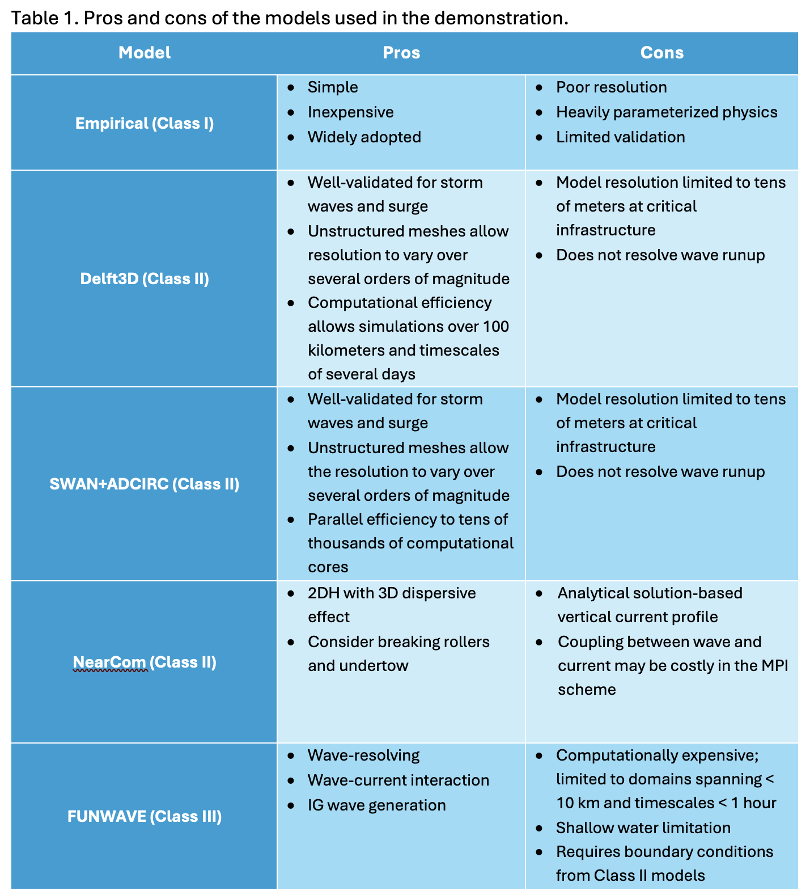
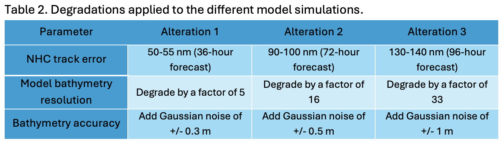
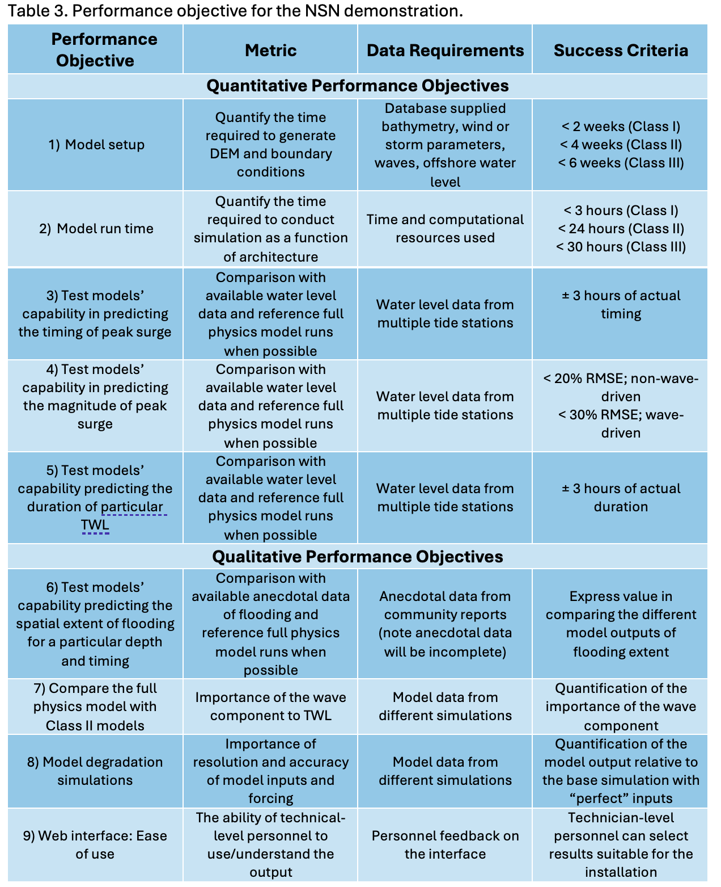

Norfolk
##########################

Prediction Approaches
=========================================

TWLs were predicted using a suite of simulation models from simple, low-cost empirical to complex, high-cost (computation and effort) physics-based models. The approaches were grouped into three classes: Class I includes empirical approaches that focus on simplified equations for storm surge (Russo, 1998) and runup (Stockdon, et al., 2006). Class II includes process-based numerical models, D-flow FM (Deltares, 2023a), ADCIRC (Dietrich et al., 2011b; Luettich and Westerink, 2004), and NearCom (Shi et al., 2013). The models are essentially based on the Nonlinear Shallow Water Equations (NSWE) and resolve tides, surges, and statistical wave conditions. The models are dynamically coupled to spectral wave models such as SWAN (e.g. Sebastian et al., 2014). Class III includes dynamical wave models that resolve individual waves. The model used here is FUNWAVE-TVD (Shi et al., 2012). The model is a computationally demanding Class III model that predicts the effects of incident sea and swell (SS), infragravity (IG ), and very low frequency (VLF) waves on TWL (Gawehn et al., 2016); processes largely ignored in past efforts.

Simulation Approaches
=========================================

The demonstration is carried out in three phases. 
Phase 1: Numerous simulations were conducted using Class I, II, and III models for Hurricane Irene. These simulations are referred to as baseline simulations for comparison to subsequent simulations and serve as the output for model calibration/validation. Using the same calibration parameters as Irene, the baseline simulations for Hurricanes Isabel, Sandy, and Michael were established for class II models. The baseline simulations were used to investigate the effect of using the parametrized (Holland Model) and modeled (ERA5) wind forcing on the accuracy of prediction of the TWL and associated flooding at NSN. The output was calibrated against measured water levels at different locations along the US East Coast and against anecdotal data for flooding.
Phase 2: Hurricane forcing was perturbed to estimate the impacts of changing the meteorological forcing (central pressure drop and the radius of maximum wind) on the model results. In addition, the impacts of climate change in terms of SLR and varying wind speeds were evaluated. 
Phase 3: A series of degradation scenarios was conducted to evaluate model performance when there is a deficit of accurate data. These degradation scenarios included bathymetry error, model grid resolution, and potential error in the hurricane track (Table 2). A one-to-one comparison was carried out to evaluate the ability of the different models to predict the TWL and its associated impacts on NSN.

Performance objectives
==========================

This demonstration tests a variety of performance objectives related to TWL-induced flooding at NSN (Table 3).  Details of the specific approaches for each objective are provided in Appendix A.
Objective 1: Document the time required to develop the model bathymetry from DEMs and the forcing boundary conditions. 
Objective 2: Document the run time and computational architecture used to conduct the various simulations. 
Objective 3: Quantify the model skill in predicting the timing of peak surge using available tide station data. 
Objective 4: Quantify the model skill in predicting the magnitude of peak surge using available tide station data. 
Objective 5: Quantify the model skill in predicting the duration of a particular flooding level using available tide station data. 
Objective 6: Quantify flooded spatial area as a function of time and flooded depth and compared the results to available anecdotal data.
Objective 7: Compare the Class III full physics model (FUNWAVE) with the Class II models for the open coast portion of the study to determine the importance of the wave component to TWL. There is no performance metric for this comparison.
Objective 8: Conduct “degradation simulations” to the base model simulation to quantify prediction error when there is a deficit of information (resolution and/or accuracy). There is no performance metric for this comparison. However, these simulations provide critical information on prediction confidence when input and forcing data are imperfect (always the case in a predictive scenario). 
Objective 9: Model simulation results to be provided as layers in a webpage for program manager review. 

Presentation of Results
============================

The reulsts can be found in the report of demonstration and `User-interactive maps <map_norfolk.html>`_

Executive Summary
==========================
Extreme weather events, enhanced via climate change, are expected to threaten coastal zones including those containing military installations, with severe flooding and erosion. This demonstration was carried out to enhance the resilience and readiness of coastal military facilities by evaluating the combined impacts of hurricanes and climate change on the Total Water Level (TWL) and associated coastal flooding at and near Naval Station Norfolk (NSN) on the US east coast.
Numerous methods were employed for the TWL prediction including empirical models, hydrodynamic models (D-Flow FM, ADCIRC, and NearCom), an energy-based wave model (SWAN), and a phase-resolving wave model (FUNWAVE-TVD). Two wind forces were used, a modeled wind force (ERA5) and a parametric wind force (Holland Model: HM). The models were used to predict the peak surge characteristics (magnitude, timing, and duration) and flood area characteristics (extent, and average and maximum flood depth) at NSN during four historical hurricanes (Irene, Isabel, Sandy, and Michael). 
Sensitivity analysis was carried out for the climate change impacts (sea level rise (SLR) and wind speed (WS)), hurricane characteristics (central pressure drop (PD) and radius of maximum wind (RMW)), and potential inaccuracies in the model inputs (storm track (ST) error, bathymetry accuracy, and mesh resolution). Finally, the time required for model building and simulation runtime were recorded as a reference for future users. 
The models were calibrated against measurements along the US east coast where a good agreement between the measured and simulated water levels was obtained. The model performance using the HM was highly dependent upon the proximity of the hurricane track to the area of interest. Hence, more accurate predictions were obtained for Hurricanes Irene and Isabel while some underestimations were detected for Hurricanes Sandy and Michael. The timing and duration of the peak surge were predicted with ±1 hour and ±3 hours accuracy respectively, while the significant wave height (SWH) was predicted with a RMSE of 0.24 m.
The analysis was undertaken at Sewells Point, NSN, therefore, different responses to each hurricane were observed at this fixed location. All hurricanes show high sensitivity to climate change impacts, SLR and WS, and changes in the hurricane track. It was found that 23% - 88% of NSN might be vulnerable to flooding by 2150. Additionally, the simulated SWH reflected high sensitivity to the WS, where up to a 50% increase in the SWH was simulated from a 22.5% increase in WS. However, the contribution from wave forcing to TWL at NSN was found to be less than the contributions from surge and SLR. 
Shifting the hurricane track showed quantifiable impacts in the vicinity of RMW where shifting Hurricane Isabel 54 nm to the east resulted in a potential flooding of up to 43.6% (D-Flow simulation) of NSN. Modifying the PD or the RMW magnitude showed marginal impacts on the model outputs. Minor inaccuracies in the bathymetry (up to 1 m) and low-resolution mesh (up to 1 km) showed limited influence on the TWL prediction. However, these changes have a significant influence on the flood area and SWH estimation. Therefore, the decision of the appropriate resolution of the model must be judged based on user need. If the main aim is to predict the water level and peak surge, lower-resolution fast simulations can be conducted. Conversely, if the main purpose is to predict coastal flooding (areal extent) associated with different extreme events, higher resolution, yet computationally expensive, simulations are essential. 
The results from the nearshore models, NearCom and FUNWAVE-TVD, indicated that wind wave effects on TWL and flooding are minimal because NSN does not face the open ocean.
This demonstration lays the foundation to enhance the resilience and readiness of NSN by providing a detailed evaluation of potential threats to support decision makers in taking more efficient and proactive actions for future adaptation.

