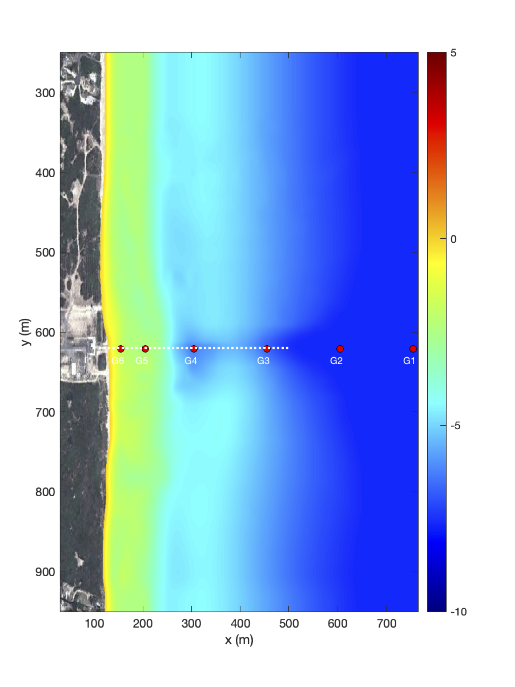
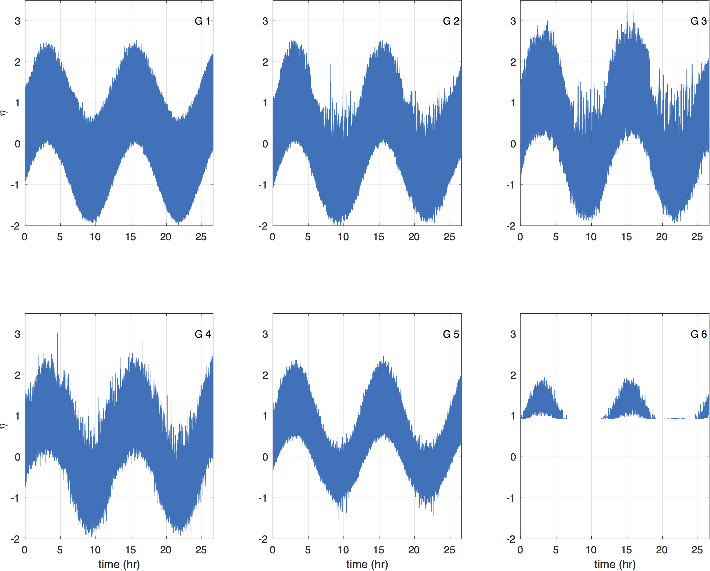

Model Bathymetry
****************************

Figure: Computational domain for wave simulation at FRF, Duck, NC. Color represents water depth. The dashed line shows the pier location. G1 -- G6 are stations recording surface elevation and velocity time series.

The figure shows a plot of the computational domain, including the water depth (color) and output stations, G1 -- G6, from offshore to nearshore.

Model Setup
************************

The model setup follows the wave simulation with an absorbing-generating boundary condition. The grid dimensions are 660 x 800 with grid sizes of 1 m and 2 m in x and y directions, respectively. The wave condition specified in wave\_data.txt contains only one wave component with a frequency of 0.1 Hz and an incident angle of 15 degrees (Note the slip of the coordinate in the model setup, it is 165 degrees in the Cartesian coordinates shown in the figure). Tidal levels are specified in tide\_data\_west.txt using the M2 constituent with a surface amplitude of 1.0 m (larger than realistic conditions at FRF for a hard test) and a period of 12.42 hours. Tidal currents are set to zero in the tidal boundary condition. The case simulates waves for a time duration of two tidal periods (89424.0 sec). 

 .. code-block:: rest

    !INPUT FILE FOR BOUSS_TVD
    ! NOTE: all input parameter are capital sensitive
    ! --------------------TITLE-------------------------------------
    ! title only for log file
     TITLE = FRF
    ! -------------------HOT START---------------------------------
    HOT_START = F
    FileNumber_HOTSTART = 1
    ! -------------------PARALLEL INFO-----------------------------
    ! 
    !    PX,PY - processor numbers in X and Y
    !    NOTE: make sure consistency with mpirun -np n (px*py)
    !    
    PX = 6
    PY = 6
    ! --------------------DEPTH-------------------------------------
    ! Depth types, DEPTH_TYPE=DATA: from depth file
    !              DEPTH_TYPE=FLAT: idealized flat, need depth_flat
    !              DEPTH_TYPE=SLOPE: idealized slope, 
    !                                 need slope,SLP starting point, Xslp
    !                                 and depth_flat
    DEPTH_TYPE = DATA
    ! Depth file
    ! depth format NOD: depth at node (M1xN1), ELE: depth at ele (MxN) 
    ! where (M1,N1)=(M+1,N+1)  
    DEPTH_FILE = depth_1mx2m.txt
    ! -------------------PRINT---------------------------------
    ! result folder
    RESULT_FOLDER = output/

    ! ------------------DIMENSION-----------------------------
    ! global grid dimension
    Mglob = 660
    Nglob = 800
    ! ----------------- TIME----------------------------------
    ! time: total computational time/ plot time / screen interval 
    ! all in seconds
    TOTAL_TIME = 96000.0
    PLOT_INTV = 600.0
    PLOT_INTV_STATION = 1.0
    SCREEN_INTV = 600.0
    FIELD_IO_TYPE = BINARY
    ! -----------------GRID----------------------------------
    ! if use spherical grid, in decimal degrees
    ! cartesian grid sizes
    DX = 1.0
    DY = 2.0
    ! --------------- INITIAL UVZ ---------------------------
    ! INI_UVZ - initial UVZ e.g., initial deformation
    !         must provide at least u,v,eta files 
    INI_UVZ = F
    ! ----------------WAVEMAKER------------------------------
    WAVEMAKER = ABSORBING_GENERATING
    WAVE_DATA_TYPE = DATA
    DepthWaveMaker = 8.0
    WaveCompFile = wave_data.txt
    ! ----------------- TIDE DATA
    TIDAL_BC_GEN_ABS = T
    TideBcType = DATA
    TideWestFileName = tide_data_west.txt
    ! ---------------- PERIODIC BOUNDARY CONDITION ---------
    ! South-North periodic boundary condition
    PERIODIC = T
    ! ---------------- SPONGE LAYER ------------------------
    ! if direct_sponge = T, L-D type sponge
    ! need to specify widths of four boundaries and parameters
    ! set width=0.0 if no sponge
    ! R_sponge: decay rate
    ! A_sponge: maximum decay rate
    ! e.g., very mild: R=0.85
    !       mild:  R=0.90, A=5.0
    !       strong, R=0.95, A=5.0
    ! if diffusion_sponge = T, need to specify Csp,width
    ! if friction_sponge = T, need to specify CDsponge,width
    DIFFUSION_SPONGE = F
    FRICTION_SPONGE = F
    DIRECT_SPONGE = F
    Csp = 1.5
    CDsponge = 10.0
    Sponge_west_width =  0.0
    Sponge_east_width =  0.0
    Sponge_south_width = 0.0
    Sponge_north_width = 0.0
    R_sponge = 0.90
    A_sponge = 5.0
    ! ----------------PHYSICS------------------------------
    ! parameters to control type of equations
    ! dispersion: all dispersive terms
    ! gamma1=1.0,gamma2=0.0: NG's equations
    ! gamma1=1.0,gamma2=1.0: Fully nonlinear equations
    DISPERSION = T
    Gamma1 = 1.0
    Gamma2 = 1.0
    Gamma3 = 1.0
    Beta_ref=-0.531
    !----------------breaking-----------------------------
    !  there are two options for breaking algorithm 
    !  1: shock-capturing breaking, need SWE_ETA_DEP
    !  2: eddy-viscosity breaking, when VISCOSITY_BREAKING = T
    !     the shock-capturing breaking is invalid
    !     Cbrk1 and Cbrk2 are parameters defined in Kennedy et al 2000
    !     suggested in this model Cbrk1=0.65, Cbrk2=0.15
    !     WAVEMAKER_Cbrk is to avoid breaking inside wavemaker 
    SWE_ETA_DEP = 0.80
    VISCOSITY_BREAKING = T
    Cbrk1 = 0.45
    Cbrk2 = 0.35
    WAVEMAKER_Cbrk = 0.65
    !----------------Friction-----------------------------
    Friction_Matrix= F
    Cd = 0.001
    ! ----------------NUMERICS----------------------------
    ! time scheme: runge_kutta for all types of equations
    !              predictor-corrector for NSWE
    ! space scheme: second-order
    !               fourth-order
    ! construction: HLLC
    ! cfl condition: CFL
    ! froude number cap: FroudeCap
    Time_Scheme = Runge_Kutta
    ! CFL
    CFL = 0.5
    ! Froude Number Cap (to avoid jumping drop, set 10)
    FroudeCap = 2.0

    ! --------------WET-DRY-------------------------------
    ! MinDepth for wetting-drying
    MinDepth=0.001
    ! -----------------
    ! MinDepthfrc to limit bottom friction
    MinDepthFrc = 0.001
    ! -------------- SHOW BREAKING -----------------------
    ! breaking is calculated using shock wave capturing scheme
    ! the criteria is only for demonstration or bubble calculation
    ! Cbrk1=0.65,Cbrk2=0.35, for irregular waves, there are much small!
    SHOW_BREAKING = F
    Cbrk1 = 0.1
    Cbrk2 = 0.075
    ! ----------------- MIXING ---------------------------
    ! if use smagorinsky mixing, have to set -DMIXING in Makefile
    ! and set averaging time interval, T_INTV_mean, default: 20s
    STEADY_TIME = 200.0
    T_INTV_mean = 200.0
    C_smg = 0.25
    ! ----------------- COUPLING -------------------------
    ! if do coupling, have to set -DCOUPLING in Makefile
    COUPLING_FILE = coupling.txt
    ! -----------------OUTPUT-----------------------------
    ! stations 
    ! if NumberStations>0, need input i,j in STATION_FILE
    NumberStations = 13
    STATIONS_FILE = station.txt
    ! output variables, T=.TRUE, F = .FALSE.
    DEPTH_OUT = T
    U = T
    V = T
    ETA = T
    Hmax = F
    Hmin = F
    MFmax = F
    Umax = F
    VORmax = F
    Umean = T
    Vmean =T
    ETAmean = T
    MASK = T
    MASK9 = F
    P = F
    Q = F
    AGE = T
    WaveHeight = T

Outputs
************************
.. figure:: images/guide/funwave/frame6_breaking.png
    :width: 350px
    :align: center
    :height: 500px
    :alt: alternate text
    :figclass: align-center

Figure: Snapshots of surface elevation, combining wave surface and tidal elevation (left) and wave-breaking signatures (right) visualized by onsets of breaking and breaking ages at mid-tide (0.0 m, top), high-tide (1.0 m, middle), and low-tide (-0.1 m, bottom)

The figure illustrates model results at mid-tide (0.0 m), high-tide (1.0 m), and low-tide (-0.1 m), respectively. The left panels show instantaneous surface elevation combining wave surface and tidal elevation. The right panels demonstrate wave-breaking signatures visualized by onsets of breaking and breaking ages. The visualization technique is based on Masnadi et al. (2020) (see the MATLAB script in the case directory). The figure shows wave surfaces and breaking patterns at different tidal stages. 

Figure: The time series of surface elevation at the measured stations G1 -- G6. 

The figure  shows the time series of surface elevation at the measured stations, G1 -- G6, defined in the figure above. Wave shoaling, breaking, and wetting-drying processes were reasonably presented by the variations of wave envelope at the stations from offshore to nearshore.  
