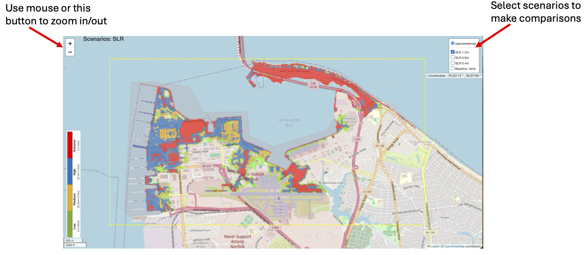

**HOW TO USE THIS WEBSITE**
************************************

.. figure:: images/website_map.png
   :width: 900px
   :height: 260px
   :align: center 

* `About: <objective.html>`_ Objectives of the project.

* `Model: <models.html>`_ Basic information about technology/methodology and modeling features of all models used in the project. 

* `Guide: <guide.html>`_ Users' guide for each model. 

* `Sites: <site.html>`_ Information about the three sites selected for the study. 

* `Interactive Map: <map.html>`_ User-interactive maps for model result presentation. The figure on the right shows how to use two major functions as interacting with a map. 

* `Demo: <demo.html>`_ Demonstrations for modeling practices for each site.

* `Video: <animation.html>`_ Animations of model results.

* `Publication: <publication.html>`_ Paper/conference Publications, abstracts, posters, and presentations related to the project. 

The website also includes the information about the team and other `website links <website.html>`_ associated with the project. 

The SITEMAP above illustrates the structure and contents of the current website. More materials will be included in the project as it moves forward. Please use `Search Engine <search.html>`_ to quickly  get the content you are interested.  
