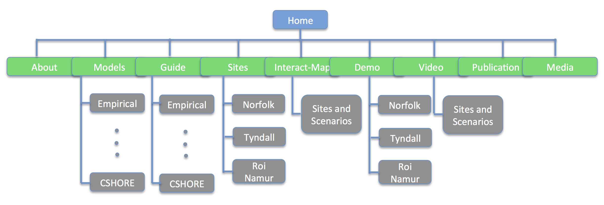

**HOW TO USE THIS WEBSITE**
************************************

* About: Objectives of the project.

* Model: Basic information about technology/methodology and modeling features of all models used in the project. 

* Guide: Users' guide for each model. 

* Sites: Information about the three sites selected for the study. 

* Interactive Map: User-interactive maps for model result presentation. 

* Demo: Demonstrations for modeling practices for each site.

* Video: Animations of model results.

* Publication: Paper/conference Publications, abstracts, posters, and presentations related to the project. 

The website also includes the information about the team and other `website links <website.html>`_ associated with the project. 

The SITEMAP above illustrates the structure and contents of the current website. More materials will be included in the project as it moves forward. Please use `Search Engine <search.html>`_ to quickly  get the content you are interested.  
