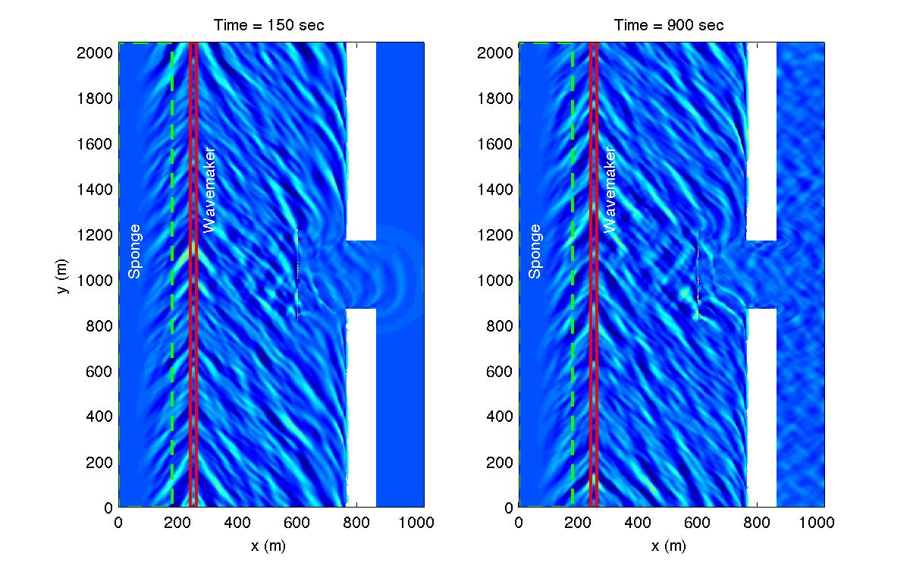

.. _section-inlet-irr30-brk:

30 deg irregular waves, a submerged/emerged breakwater
######################################################

 Set descriptive title for your simulation:

 .. code-block:: rest

        !-----TITLE-----
         TITLE = inlet_irr_30deg_brk
 
 Comment out the :code:`OBSTACLE_FILE` and replace the :code:`DEPTH_FILE` with a bathymetry file representative of a submerged breakwater:

 .. code-block:: rest

        !-----DEPTH-----
         DEPTH_TYPE = DATA
         DEPTH_FILE = ../bathy/dep_shoal_inlet_brk.txt

         ! OBSTACLE_FILE = ../bathy/obs_shoal_inlet.txt

