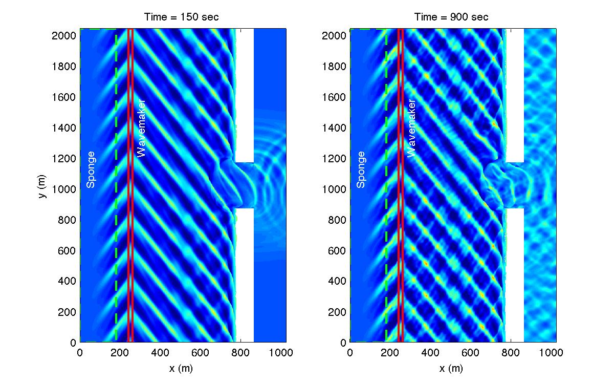

.. _section-inlet-reg30:

Regular wave 30 deg oblique incidence
#####################################

 Set descriptive title for your simulation:

 .. code-block:: rest

        !-----TITLE-----
         TITLE = inlet_reg_30deg

 Set the incident wave angle to 30 deg:

 .. code-block:: rest

        !-----WAVEMAKER-----
         WAVEMAKER = WK_REG
         DEP_WK = 10.0 
         Xc_WK = 250.0 
         Yc_WK = 0.0 
         Tperiod = 12.0 
         AMP_WK = 1.0 
         Theta_WK = 30.0     ! here

