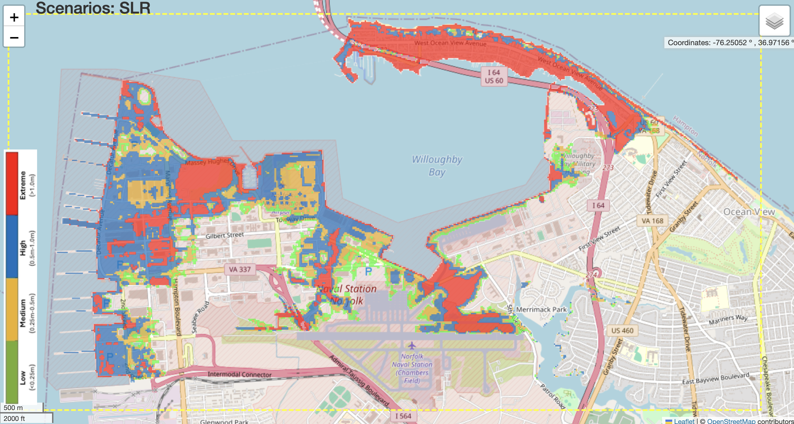

**USER-INTERACTIVE MAP AND RESULTS**
============================================

User-interactive maps are created by Folim, which is an open-source python code for visualizaton of an interactive LEAFLET map. The figure shown on the right is an example of inundation map generated based on model results, in which users can check flooded area, wave height, surface elevation, etc, simulated with different storm conditions. 

.. toctree::
   :maxdepth: 2
   
   map_norfolk
   map_tyndall
   map_roi_namur
