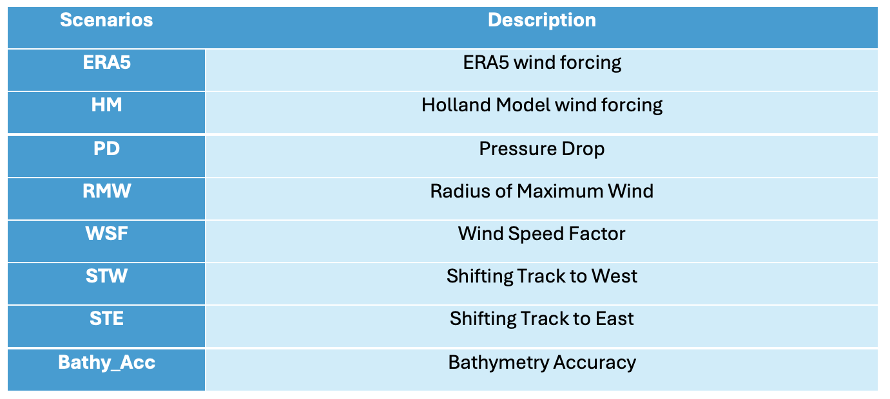
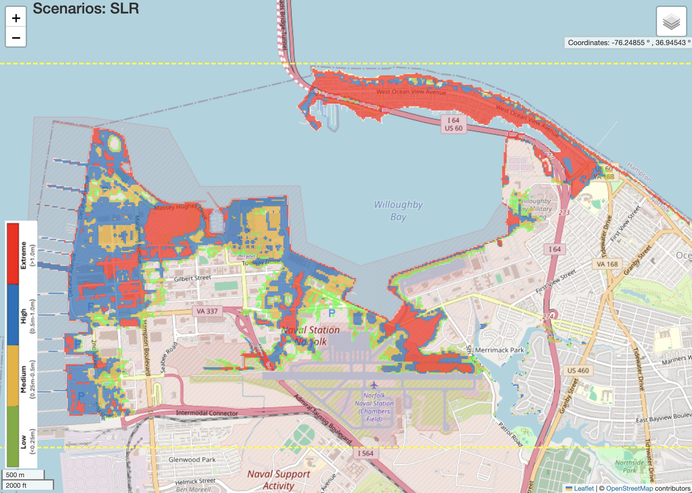
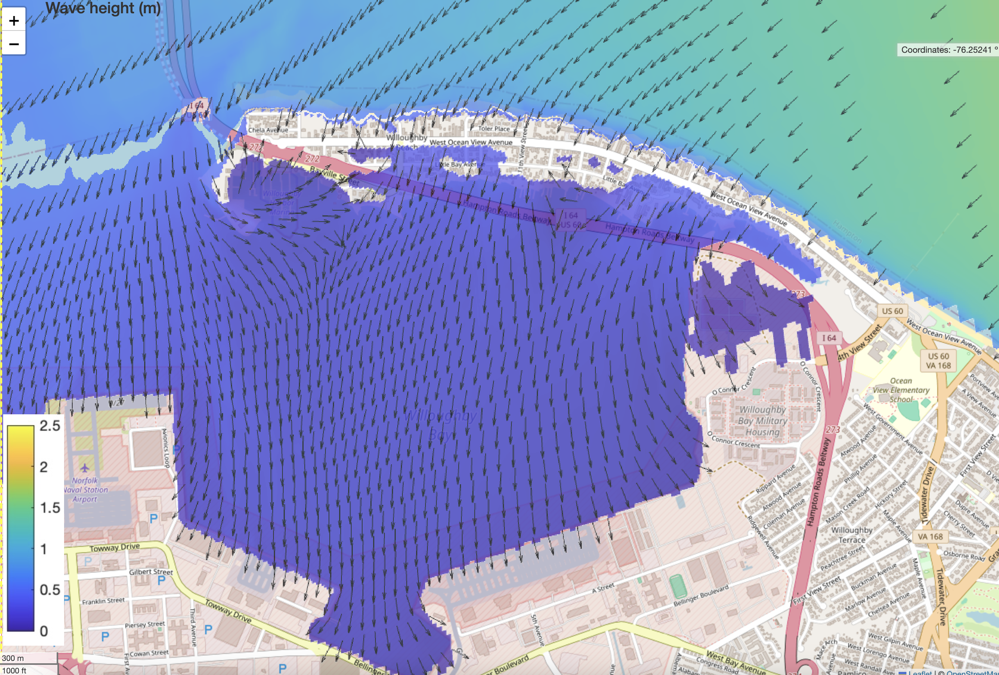
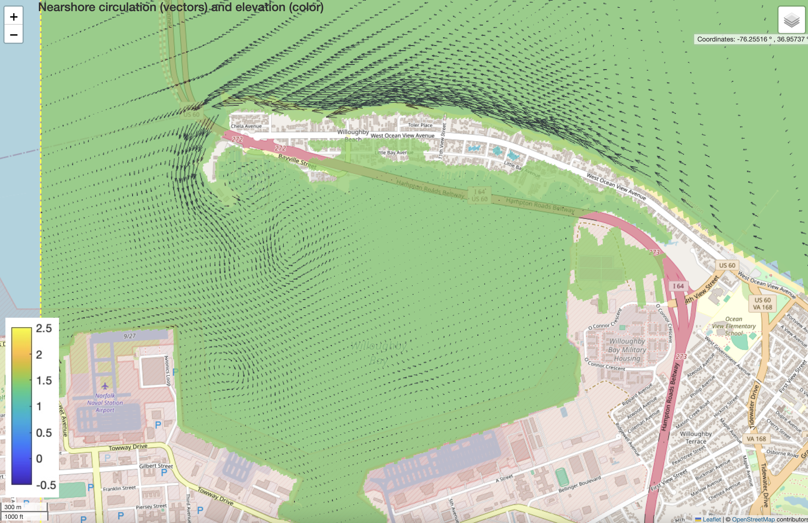
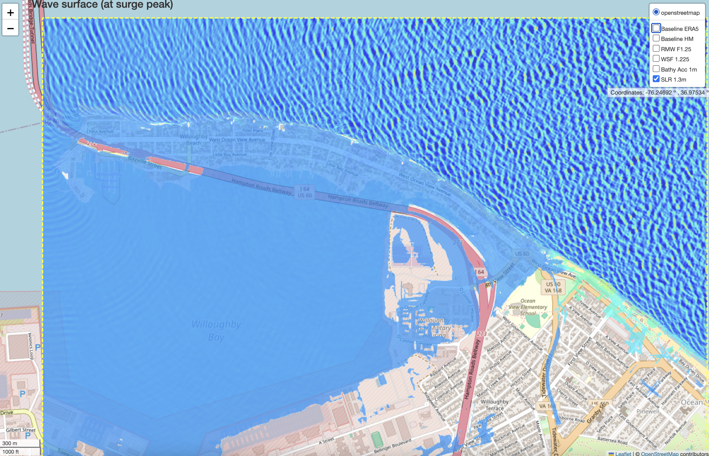

Norfolk
##########################

Inundation depth predicted by D-Flow
========================================================

**Hurricane Irene**

* `Baseline Scenario: Hurriance Irene (Holland Model) <../../interactive_map/Dflow_flood/Baseline.html>`_
* `Scenarios: SLR effects (Irene) <../../interactive_map/Dflow_flood/SLR.html>`_
* `Scenarios: Wind Speed Factors (Irene) <../../interactive_map/Dflow_flood/WSF.html>`_
* `Scenarios: Effects of Radius of Maximum Wind Speed (Irene) <../../interactive_map/Dflow_flood/RMW.html>`_
* `Scenarios: Effects of Pressure Drop (Irene) <../../interactive_map/Dflow_flood/PD.html>`_
* `Scenarios: Effects of Bathymetry Accuracy (Irene) <../../interactive_map/Dflow_flood/Bathy_Acc.html>`_
* `Scenarios: Effects of Shifting Track to East (Irene) <../../interactive_map/Dflow_flood/STE.html>`_
* `Scenarios: Effects of Shifting Track to West (Irene) <../../interactive_map/Dflow_flood/STW.html>`_

**Hurricane Isabel**

* `Baseline Scenario: Hurriance Isabel (Holland Model) <../../interactive_map/Dflow_flood/IS_Baseline.html>`_
* `Scenarios: SLR effects (Isabel) <../../interactive_map/Dflow_flood/IS_SLR.html>`_
* `Scenarios: Wind Speed Factors (Isabel) <../../interactive_map/Dflow_flood/IS_WSF.html>`_
* `Scenarios: Effects of Radius of Maximum Wind Speed (Isabel) <../../interactive_map/Dflow_flood/IS_RMW.html>`_
* `Scenarios: Effects of Pressure Drop (Isabel) <../../interactive_map/Dflow_flood/IS_PD.html>`_
* `Scenarios: Effects of Shifting Track to East (Isabel) <../../interactive_map/Dflow_flood/IS_STE.html>`_
* `Scenarios: Effects of Shifting Track to West (Isabel) <../../interactive_map/Dflow_flood/IS_STW.html>`_

**Hurricane Sandy**

* `Baseline Scenario: Hurriance Sandy (Holland Model) <../../interactive_map/Dflow_flood/SA_Baseline.html>`_
* `Scenarios: SLR effects (Sandy) <../../interactive_map/Dflow_flood/SA_SLR.html>`_
* `Scenarios: Wind Speed Factors (Sandy) <../../interactive_map/Dflow_flood/SA_WSF.html>`_
* `Scenarios: Effects of Radius of Maximum Wind Speed (Sandy) <../../interactive_map/Dflow_flood/SA_RMW.html>`_
* `Scenarios: Effects of Pressure Drop (Sandy) <../../interactive_map/Dflow_flood/SA_PD.html>`_
* `Scenarios: Effects of Shifting Track to East (Sandy) <../../interactive_map/Dflow_flood/SA_STE.html>`_
* `Scenarios: Effects of Shifting Track to West (Sandy) <../../interactive_map/Dflow_flood/SA_STW.html>`_

Nearcom Results (Wave effects, Hurricane Irene)
====================================================

* `Wave height (SWAN) <../../interactive_map/Nearcom/Nearcom_Hs.html>`_
* `Wave setup and nearshore circulation (SHORECIRC) <../../interactive_map/Nearcom/Nearcom_Eta_uv.html>`_
* `Flooded area (SHORECIRC) <../../interactive_map/Nearcom/Nearcom_flood.html>`_

FUNWAVE-TVD Results (Wave effects, Hurricane Irene)
====================================================
* `Wave surface at peak surge <../../interactive_map/Funwave/FUNWAVE_snap.html>`_
* `Wave height <../../interactive_map/Funwave/FUNWAVE_hs.html>`_
* `Wave setup <../../interactive_map/Funwave/FUNWAVE_setup.html>`_
* `flooded area <../../interactive_map/Funwave/FUNWAVE_flood.html>`_

