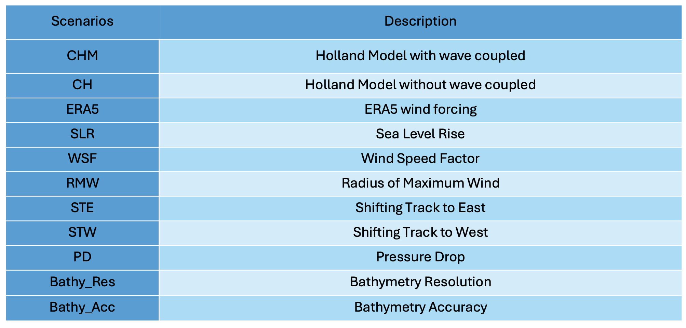
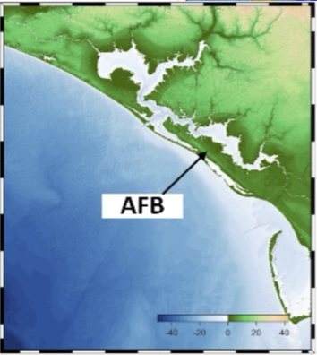
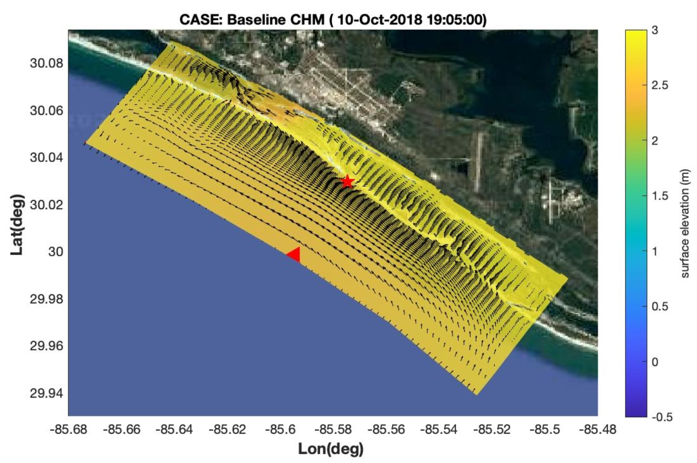

Tyndall
##########################

Inundation depth predicted by D-Flow
========================================================

* `Baseline Scenario: Hurriance Michael (Holland Model and ERA5) <../../interactive_map/Tyndall_DFlow/saved_maps/Baseline_3cases.html>`_
* `Scenarios: SLR effects <../../interactive_map/Tyndall_DFlow/saved_maps/SLR.html>`_
* `Scenarios: Wind Speed Factors  <../../interactive_map/Tyndall_DFlow/saved_maps/WSF.html>`_
* `Scenarios: Effects of Radius of Maximum Wind Speed  <../../interactive_map/Tyndall_DFlow/saved_maps/RMW.html>`_
* `Scenarios: Effects of Pressure Drop  <../../interactive_map/Tyndall_DFlow/saved_maps/PD.html>`_
* `Scenarios: Effects of Bathymetry GN  <../../interactive_map/Tyndall_DFlow/saved_maps/Bathy_GN.html>`_
* `Scenarios: Effects of Bathymetry Resolution  <../../interactive_map/Tyndall_DFlow/saved_maps/Bathy_Res.html>`_
* `Scenarios: Effects of Shifting Track to East  <../../interactive_map/Tyndall_DFlow/saved_maps/STE.html>`_
* `Scenarios: Effects of Shifting Track to West  <../../interactive_map/Tyndall_DFlow/saved_maps/STW.html>`_ 

Inundation depth predicted by Nearcom
========================================================

* `Nearcom Baseline Scenario: Hurriance Michael (Holland Model and ERA5) <../../interactive_map/Tyndall_Nearcom/saved_maps/Baseline_3cases.html>`_
* `NearcomScenarios: SLR effects <../../interactive_map/Tyndall_Nearcom/saved_maps/SLR.html>`_
* `NearcomScenarios: Wind Speed Factors  <../../interactive_map/Tyndall_Nearcom/saved_maps/WSF.html>`_
* `NearcomScenarios: Effects of Radius of Maximum Wind Speed  <../../interactive_map/Tyndall_Nearcom/saved_maps/RMW.html>`_
* `NearcomScenarios: Effects of Pressure Drop  <../../interactive_map/Tyndall_Nearcom/saved_maps/PD.html>`_
* `NearcomScenarios: Effects of Bathymetry GN  <../../interactive_map/Tyndall_Nearcom/saved_maps/GN.html>`_
* `NearcomScenarios: Effects of Bathymetry Resolution  <../../interactive_map/Tyndall_Nearcom/saved_maps/Res.html>`_
* `NearcomScenarios: Effects of Shifting Track to East  <../../interactive_map/Tyndall_Nearcom/saved_maps/STE.html>`_
* `NearcomScenarios: Effects of Shifting Track to West  <../../interactive_map/Tyndall_Nearcom/saved_maps/STW.html>`_ 

