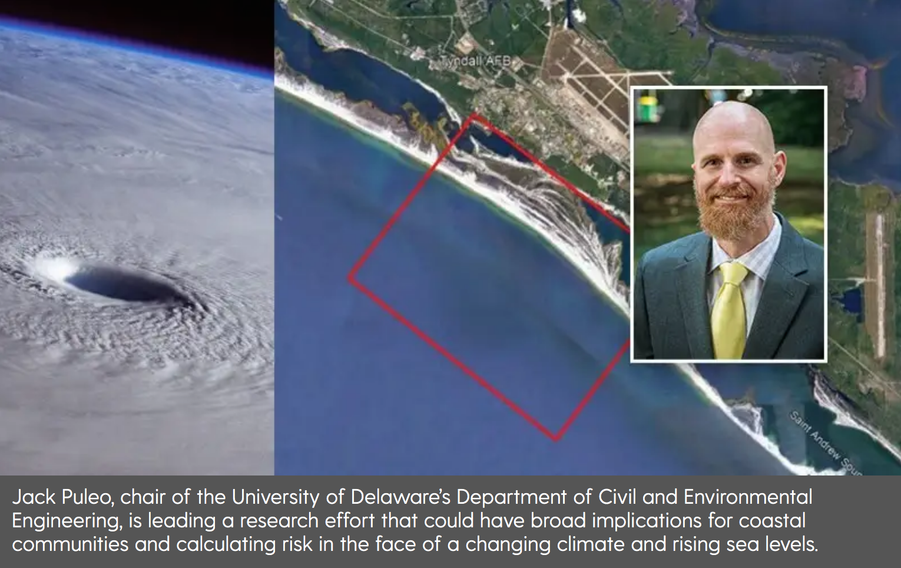

**SOCIAL MEDIA**
=====================================

    `Preparing for a changing climate (UD interview) <https://www.udel.edu/udaily/2023/january/civil-engineering-coastal-flooding-military-bases-pentagon-department-defense-research/>`_

.. raw:: html

   <iframe width="560" height="315" src="https://www.youtube.com/embed/_eTD7w03obY?rel=0" frameborder="0" allowfullscreen></iframe>

Department feature about summer research by Jack Voight
