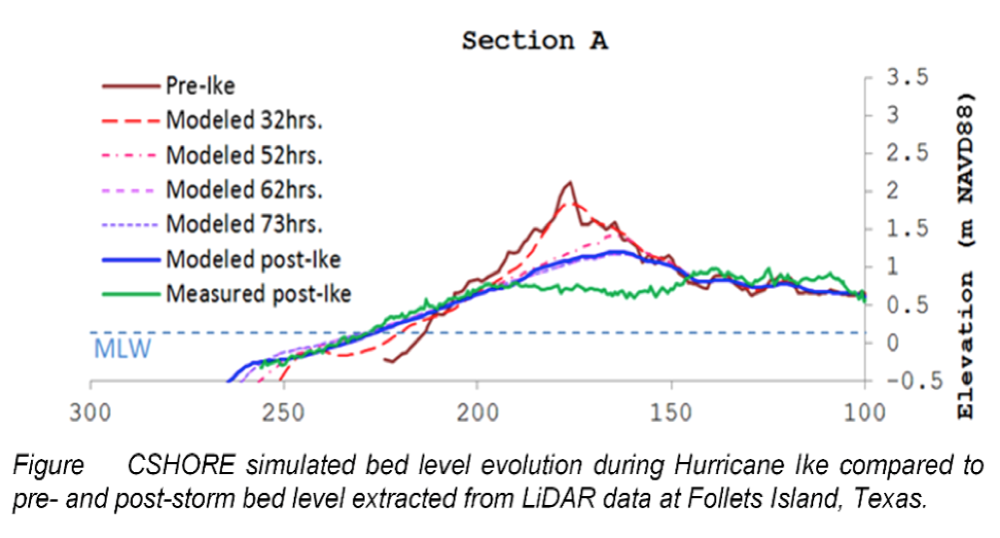

CSHORE
#############

CSHORE is an efficient process-based 1D cross-shore coastal response model. The model includes a time-averaged and depth-averaged combined wave and cross-shore current model, a time-averaged sediment transport model, a probabilistic model for the intermittently wet and dry zone, as well as empirical formulas for irregular wave runup (Johnson et al., 2012; Kobayashi, 2013; Kobayashi et al., 2008a). The model employs a linear wave theory-based model with an assumed Gaussian distribution of the free-surface elevation below mean sea level (MSL) and a model based on the time-averaged continuity and momentum equations derived from nonlinear shallow-water equations above still water level (SWL) to provide hydrodynamic forcing for sediment transport and morphodynamics. Output from both models are averaged in the zone between SWL and MSL to provide smooth results over the entire computation domain. The actual location of SWL and MSL at each time step dictates where along the profile the two models are applied.  CSHORE predicts cross-shore variations of the mean and standard deviation of the free surface elevation, the depth-averaged cross-shore current, the cross-shore velocity standard deviation, the cross-shore bed-load transport rate, and the cross-shore suspended sediment transport rate. The root-mean-square wave height, spectral peak period and setup/setdown with respect to SWL are used as input at the offshore boundary of the computation domain. Only the initial bottom profile elevation is specified for the computation of the entire model run. Since CSHORE is a 1D cross-shore time-averaged model, it is most effective when applied to representative shore locations where bathymetric contours are approximately parallel. Computational efficiency, robustness, and relative accuracy are some of the major advantages of using CSHORE as a tool to predict beach profile changes, runup, overtopping, and overwash (Figlus et al., 2018; Harter and Figlus, 2017).
