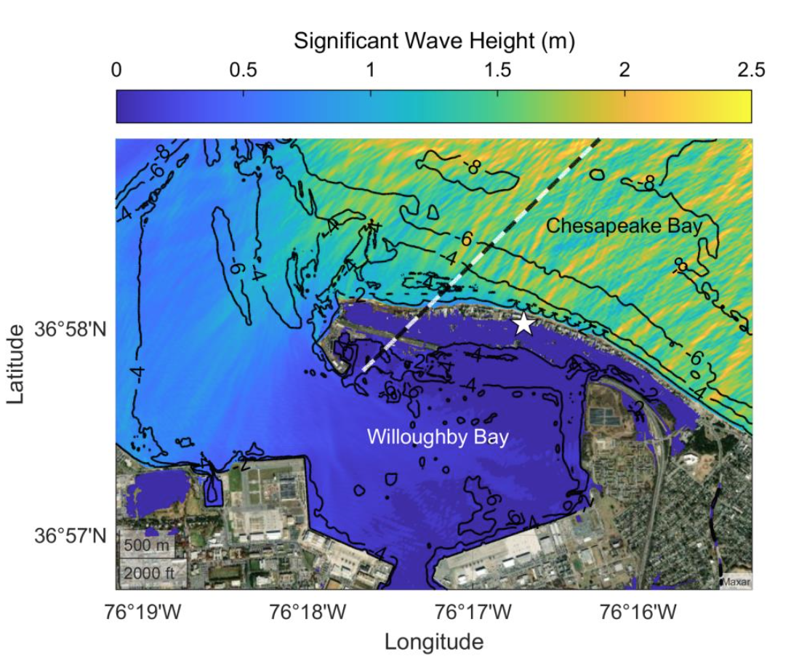
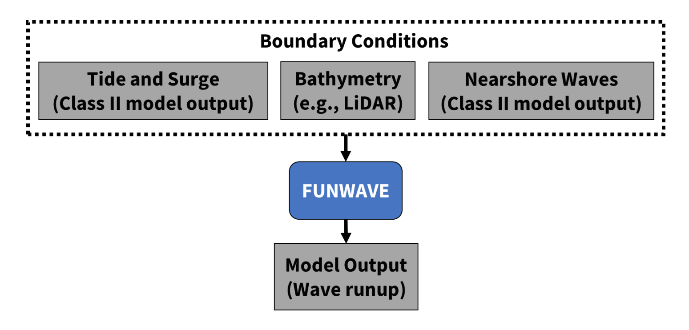

FUNWAVE-TVD
###########################

FUNWAVE–TVD is the TVD version of the fully nonlinear Boussinesq wave model (FUNWAVE) developed at the University of Delaware (Shi et al., 2012). It is a public domain model maintained by a group of institutions, including the Center for Applied Coastal Research (CACR) at the University of Delaware, Coastal Hydraulics Laboratory, USACE, and the
University of Rhode Island. The FUNWAVE model was initially developed by (Kirby et al., 1998) based on (Wei et al., 1995). The development of the TVD version was motivated by a growing
demand for phase-resolving modeling of nearshore waves and coastal inundation during storm or tsunami events, and predicting sediment transport and short-term morphological processes in a wave-resolving manner.

As a nearshore shallow-to-intermediate water Boussinesq-type numerical wave model,
FUNWAVE can resolve many coastal processes. Related to the scopes of this demonstration
project, it can predict wave propagation/transformation, refraction, diffraction, reflection, nonlinear shoaling, wave-induced nearshore circulation, nonlinear wave-wave interaction, wave-current interaction, wave breaking, runup and overtopping, IG waves, nearshore sediment transport, and short-term morphological changes. The TVD-type solver particularly has an advantage in resolving wetting and drying processes accurately in modeling storm-induced coastalinundation. The figure on the right shows an example of FUNWAVE output showing nearshore significant wave heights at Norfolk, VA
under hurricane forcing.


FUNWAVE-TVD has been benchmarked for wind wave application in a series of the USACE-funded projects, and tsunami application during the National Tsunami Hazard Mitigation Program (NTHMP) which provided the benchmarking standard for judging model acceptance for use in development of coastal inundation maps and evacuation plans. Source code, documentation, and descriptions and input files for carrying out benchmark tests and various example calculations are available at the FUNWAVE-TVD site (https://fengyanshi.github.io/build/html/index.html). In this demonstration plan, FUNWAVE is used to simulate the contribution of wave runup to coastal flooding under hurricane forcing with workflow shown in the figure on the right.

`FUNWAVE-TVD Documentation <https://fengyanshi.github.io/build/html/index.html>`_

`FUNWAVE-TVD Github Repository <https://github.com/fengyanshi/FUNWAVE-TVD>`_
