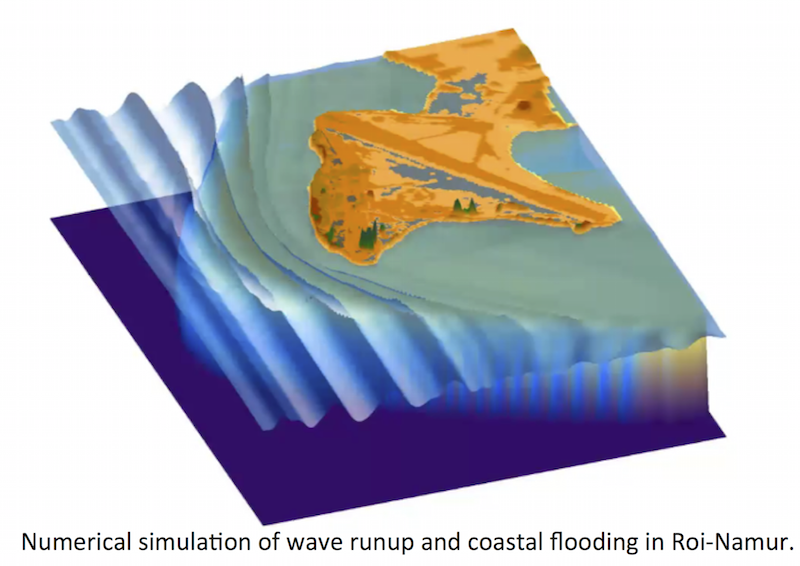

XBEACH
#############

XBeach is an open-source, process-based, numerical model used to simulate hydrodynamics and morpho     dynamics over complex bathymetry (Roelvink et al., 2018, 2009). XBeach model skill has been demonstrated on sandy barrier islands (Van der Lugt et al. 2019,  Shambach et al. 2018, Lindemer et al., 2010; McCall et al., 2010), urbanized coasts (Nederhoff, 2014; Van Verseveld et al., 2015), and gravel beaches (McCall et al., 2015) among others. The hydrodynamic modules are capable of simulating short and long wave transformation, wave-induced setup, currents, and inundation. The morphodynamic modules are capable of simulating bed load transport, suspended load transport, bed level changes, and all four dune impact regimes as defined by Sallenger (2000). Coastal structures can be represented as “non-erodible” grid cells such that changes in elevation in those cells are not allowed to occur, and vegetation can be included by specifying vegetation type and location files. As such, XBeach is capable of simulating sea-swell wave transformation (refraction, shoaling and breaking), low-frequency wave (infragravity wave) transformation (generation, propagation and dissipation), wave-induced set-up and unsteady currents, as well as overwash and coastal flooding, also around      structures or on vegetated coasts.                

The 2D depth-averaged model can be executed in surfbeat mode (XBeach-SB) or      non-hydrostatic mode (XBeach-NH). Both modes resolve infragravity waves, which have been shown to be important in dune erosional processes (e.g. Roelvink et al., 2009). XBeach-SB resolves the short-wave envelope without phase information, thereby reducing resolution requirements and computation time requirements. The nonlinear shallow water wave equations are used to calculate low frequency and mean flows. A wave action balance equation, which is coupled with a roller energy balance equation, is used to determine radiation stress gradients. Sediment transport is modeled using a depth-averaged advection diffusion Van Rijn–Van Thiel de Vries equation where sediment entrainment and deposition is determined by the difference between the depth-averaged and equilibrium sediment concentrations (Van Thiel de Vries, 2009). Bed levels are updated according to gradients in sediment transport rates and an avalanching term to model dune slumping that uses critical bed slopes for wet and dry grid cells. XBeach-NH fully resolves the short waves by solving nonlinear shallow water equations and applying a non-hydrostatic pressure correction term. The non-hydrostatic pressure term is disabled when waves reach or exceed a certain steepness to simulate wave breaking. XBeach-NH is particularly useful on steep beaches, when wave asymmetry and skewness need to be resolved, or where diffraction is a dominant process. XBeach has been validated with a wide range of analytical, laboratory and field test cases using a standard set of parameter settings.
