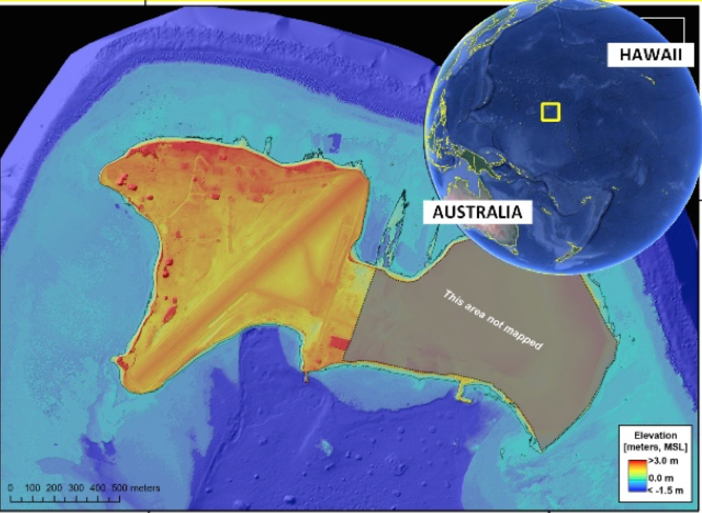

Site Description
##########################

Roi Namur, an island on the Kwajalein Atoll, Marshall Islands, contains the Ronald Reagan Ballistic Missile Defense Test Site. Roi Namur is a low-lying coral atoll with a narrow beach and shallow sloping reef platform that drops off steeply to the deep ocean. Tide range is roughly 2 m with an energetic wave climate. The island is susceptible to large wave events and tropical storms.

